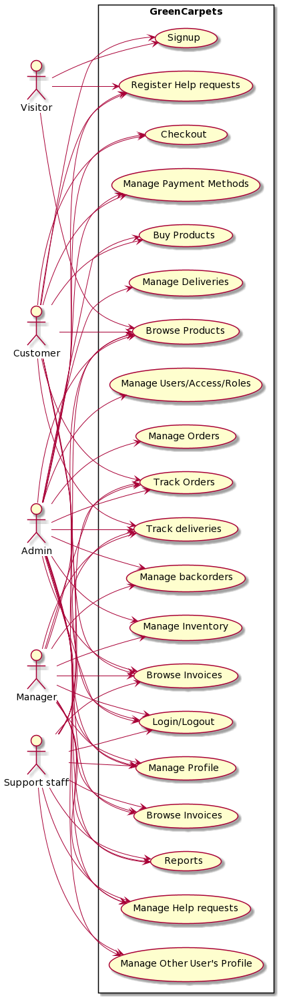
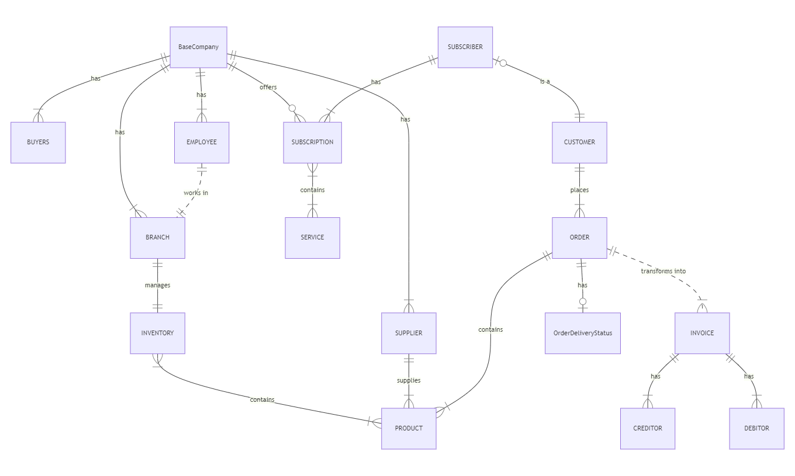
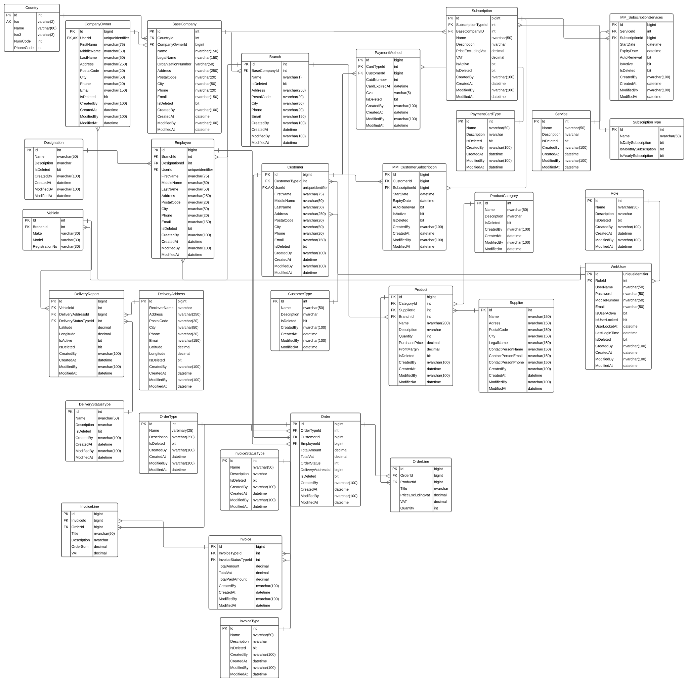

# Green Carpets 

Wisdom?

**Introduction**

* We offer new and used carpet leasing services to our customers through different subscriptions.
* We take care off every thing from  maintianing ,cleaning and replacment of carpets.
* When the carpets deteriorate they are sold to manufacturing industry to recycle and reproduce new products.
* None of our products are used for landfilling.

#### 																Project Business Case 

| Project Name               | Green Carpets As          |
| -------------------------- | ------------------------- |
| Project Sponsor            | Shahzad Ali Khan          |
| Project Managers           | M Shoaib/ Mashood Shaukat |
| Date of Project Initiation | 02.08.2021                |
| Last Revision Date         | 24.09.2021                |

 

#### Reasons: 

- We believe in eco-friendly and reusability of product which makes big impact on environment. Our main focus is to restrain customers from buying new carpets instead make them buy used carpets which are almost new. None of our products are used for landfilling. 

#### What do we do? 

- Green Carpet As is conceptual business model based on circular Economy. We buy new and used carpets from vendors and sell them through subscription to business and private user. We offer new and used carpet leasing services to our customers through different subscriptions. We take care of everything from maintaining, cleaning and replacement of carpets. 

#### How Do We Do it 

We sell our products and service though different means to our customers which are as follows: 

- Online 
- On premises 

#### Who Do We Serve? 

We lend our services to private, business and wholesale customers. We have designed different subscriptions to cater the needs of all the customers. Our services can also be availed without subscription but with separate prices. 

#### Our Competitive Advantage:

The services we are offering to our customers are incomparable. None of our competitors are offering cleaning, delivering and replacement of carpets in a single subscription. 

#### Time Scale: 

We as a company are putting all our efforts in this project and it’s expected to complete at the end of September. 

---

**Use Case Diagram :** 

---

**Domain Class Model :**

---

**Entity Relationship Diagram (ERD):**

 [entity-relationship-diagram.pdf](documentation/design-and-analysis/entity-relationship-diagram.pdf) 

https://lucid.app/lucidchart/5156cb08-613f-4ea8-965e-4b86f23a14f3/edit?page=p~O4IXituQhc#

---
